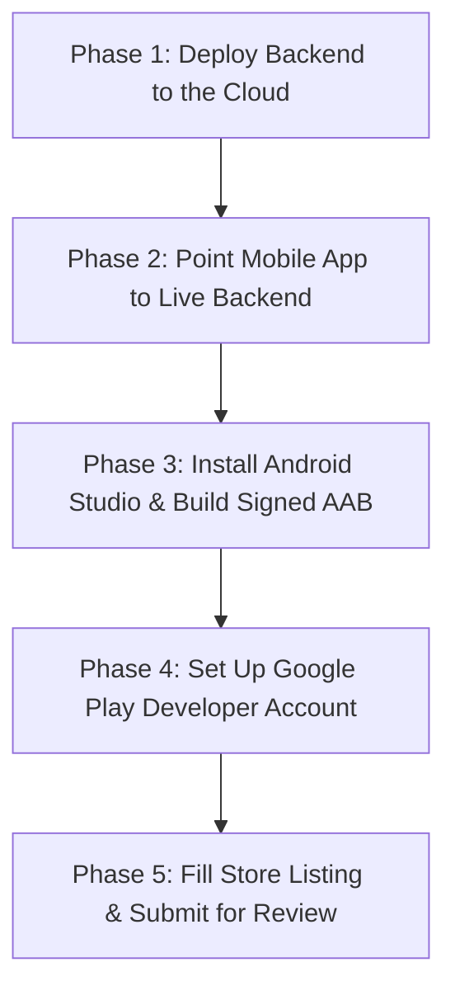

# Complete Beginner's Guide: Publishing GourmetOS to Google Play Store

This step-by-step guide explains everything from zero experience to having **GourmetOS Restaurant System** live on the Google Play Store.

---

## 🗺️ The 5-Phase Road Map



---

## Phase 1: Deploy Backend to the Cloud (Free / Low Cost)

Right now, your database and server run on your personal laptop at `localhost:4000`. Phones downloaded from the Play Store cannot reach your laptop. We must place the server on the internet with a public link (e.g., `https://gourmetos-api.onrender.com`).

### Using **Render.com** (Simplest & Free/Cheap):
1. Sign up at [render.com](https://render.com) using your GitHub account.
2. Click **New +** → **Web Service**.
3. Connect your repository: `werone-henok/Restaurant-system`.
4. Configure the Web Service:
   - **Name**: `gourmetos-api`
   - **Root Directory**: `server`
   - **Runtime**: `Node`
   - **Build Command**: `npm install && npm run build`
   - **Start Command**: `npm start`
   - **Instance Type**: `Free` (or $7/mo Starter for production stability)
5. Under **Environment Variables**, add:
   - `PORT`: `4000`
   - `JWT_SECRET`: `your-super-secret-key-phrase`
   - `NODE_ENV`: `production`
6. Click **Create Web Service**.
7. Render will build and deploy your API. Once ready, copy your public URL:
   `https://gourmetos-api.onrender.com`

---

## Phase 2: Point Mobile App to Live Backend

Now we tell the mobile frontend where your live cloud backend is.

1. Open [`client/src/api/client.ts`](file:///c:/Users/Werone/.gemini/antigravity-ide/scratch/Restaurant-system/client/src/api/client.ts).
2. Change line 1:
   ```typescript
   // Replace localhost with your live Render backend URL:
   const API_BASE_URL = 'https://gourmetos-api.onrender.com/api';
   ```
3. In your terminal, build the web app and sync the Android files:
   ```powershell
   cd c:\Users\Werone\.gemini\antigravity-ide\scratch\Restaurant-system\client
   npm run build
   npx cap sync android
   ```

---

## Phase 3: Install Android Studio & Generate the App Bundle (.aab)

Google Play does not accept raw code; it requires a compiled **Android App Bundle (`.aab`)** digitally signed with a security key.

### 1. Install Android Studio
- Download and install [Android Studio](https://developer.android.com/studio) (Standard setup).
- Open Android Studio and install the **Android SDK** (it will prompt you automatically on first launch).

### 2. Open Your Project in Android Studio
- In Android Studio, click **File** → **Open...**
- Navigate to:
  ```
  c:\Users\Werone\.gemini\antigravity-ide\scratch\Restaurant-system\client\android
  ```
- Wait 2–3 minutes for Gradle to download dependencies and say **"BUILD SUCCESSFUL"** at the bottom.

### 3. Generate a Signed Release Bundle
1. In Android Studio top menu, click:
   **Build** ➔ **Generate Signed Bundle / APK...**
2. Select **Android App Bundle** and click **Next**.
3. Under **Key store path**, click **Create new...**:
   - **Key store path**: Choose a safe folder (e.g. `C:\Users\Werone\keystores\gourmetos.jks`).
   - **Password**: Choose a strong password (write it down!).
   - **Alias**: `gourmetos-key`
   - **Password**: Enter the same password.
   - **Validity (years)**: Leave at `25`.
   - **First and Last Name**: Enter your name or company name.
   - Click **OK**.
   > [!CAUTION]
   > Save this `.jks` file and password in a safe backup (Google Drive, password manager). If you lose this key, Google will NEVER allow you to update your app in the future!
4. Click **Next**.
5. Select:
   - **Build Variants**: `release`
6. Click **Create**.
7. In ~1 minute, a popup will say:
   *"App bundle(s) generated successfully for variant release."*
   Click **locate** to see your file:
   `.../client/android/app/release/app-release.aab`

This `.aab` file is what you upload to Google.

---

## Phase 4: Create Your Google Play Developer Account

1. Go to the [Google Play Console](https://play.google.com/console/signup).
2. Sign in with your Google account.
3. Choose **Account Type**:
   - **Personal**: Easiest to start (requires verifying your identity and a 14-day closed test with 12 testers under 2024 Google policy).
   - **Organization**: Recommended if you have a registered business/license (allows immediate public release without the 14-day tester restriction).
4. Pay the **$25 USD one-time registration fee**.
5. Complete identity verification (upload ID card / passport). Google verifies within 24–48 hours.

---

## Phase 5: Create App & Store Listing in Play Console

Once verified:

### 1. Create New App
- Go to Google Play Console ➔ **Create App**.
- **App name**: `GourmetOS Restaurant System`
- **Default language**: `English (United States)`
- **App or Game**: `App`
- **Free or Paid**: `Free`
- Accept Developer Declarations and click **Create App**.

### 2. Complete "Set up your app" Tasks
Google provides a dashboard checklist you must complete:
1. **Privacy Policy**: 
   - You need a privacy policy URL. You can use a free generator like [privacypolicies.com](https://www.privacypolicies.com) or host a simple markdown/HTML page on GitHub Pages.
2. **App Access**:
   - Select *"All or some functionality is restricted"* because your app has a login PIN.
   - Provide test credentials for Google's reviewers:
     - Role: Admin
     - PIN: `1111`
     - Instructions: *"Enter PIN 1111 to access admin features."*
3. **Ads**: Select *"No, my app does not contain ads"*.
4. **Content Rating**: Complete the questionnaire (Select "Utility / Productivity" → No violence/adult content → Rating: Everyone).
5. **Target Audience**: Select **18 and older** (Business/Restaurant management software).
6. **Data Safety**:
   - Select that the app collects user names, email/PIN, and photos (for inventory invoices/waste records).

### 3. Main Store Listing (Graphics & Descriptions)
- **Short description** (up to 80 characters):
  *All-in-one restaurant management, POS, kitchen routing, and inventory system.*
- **Full description**:
  *Highlight key features: multi-branch management, table floor plans, waiter orders, chef KDS screen, cashier billing with Telebirr/CBE Birr support, and live inventory control.*
- **App Icon**: 512 × 512 PNG (transparent or solid background).
- **Feature Graphic**: 1024 × 500 PNG.
- **Phone Screenshots**: At least 4 screenshots (take them directly from your browser or Android simulator showing the Login, Waiter, Kitchen, and Dashboard screens).

---

## Phase 6: Upload .AAB and Roll Out

1. In the Play Console left menu, go to **Production** (or **Closed Testing** if prompted).
2. Click **Create new release**.
3. In the **App bundles** box, drag and drop your **`app-release.aab`** file from Phase 3.
4. **Release name**: e.g., `1.0.0 (1)`.
5. **Release notes**: 
   ```
   Initial release of GourmetOS Restaurant System.
   - Multi-role support (Admin, Waiter, Cashier, Chef, Barista, Storekeeper)
   - Real-time kitchen display and inventory tracking
   ```
6. Click **Next** ➔ **Save** ➔ **Review Release**.
7. If there are no errors, click **Start rollout to Production**!

---

## ⏱️ Review & Live Timeline
- Google's automated checks and human reviewers usually take **1 to 3 business days**.
- Once approved, GourmetOS will appear live on the Google Play Store worldwide!
